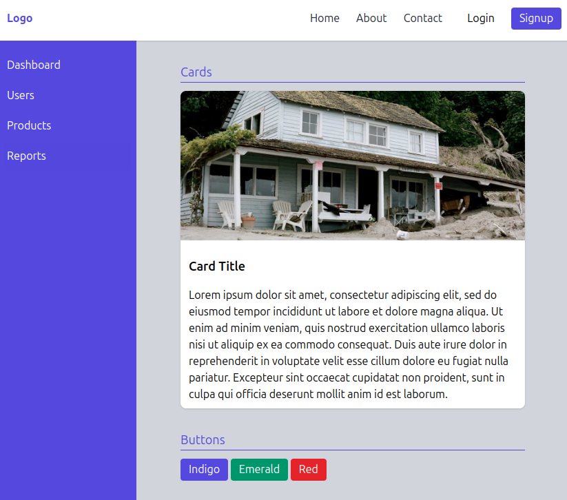

# Tailwind CSS with Docker



Requirements:
- Docker
- Docker Compose
- Make

### Project setup

Access the page: http://localhost:3000

```bash
# To run the project
$ make init

# To finish press type
$ make down

# For more controls
$ make init        # Build the container, run the project and watch file changes
$ make build       # Build the container
$ make down        # Delete the container
$ make start       # Start the container
$ make stop        # Stop the container
$ make npm-watch   # Watch file changes
$ make npm-build   # Build the production-ready css
$ make shell       # Access the container as "node" user
$ make shell-root  # Access the container as "root" user
```

### Basic commands
```bash
# Create package.json
$ npm init -y

# Install Tailwindcss as dev dependency
$ npm install -D tailwindcss

# Create Tailwindcss config file
$ npx tailwindcss init

# Configure to watch all html and js files
module.exports = {
  content: [
    "./src/**/*.{html,js}"
  ],
}

# Watch changes in source files
$ npx tailwindcss -i ./src/input.css -o ./src/dist/output.css --watch
```
